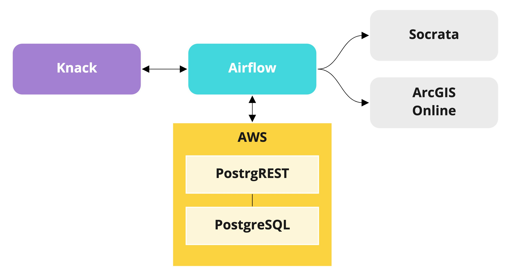

# atd-knack-services

Integration services for ATD's Knack applications.

## Design

ATD Knack Services is comprised of a Python library (`/services`) and scripts (`/scripts`) which automate the flow of data from ATD's Knack applications to downstream systems.

These utilities are designed to:

- incrementally offload Knack application records and metadata as a JSON documents in a collection of S3 data stores
- incrementally fetch records and publish them to external systems such as Socrata and ArcGIS Online
- lay the groundwork for further integration with a data lake and/or a data warehouse
- be deployed in Airflow or similar task management frameworks



## Configuration

### S3 Data Store

Data is stored in an S3 bucket (`s3://atd-knack-services`), with one subdirectory per Knack application per environment. Each app subdirectory contains a subdirectory for each container, which holds invdividual records stored as JSON a file with its `id` serving as the filename. As such, each store follows the naming pattern `s3://atd-knack-servies/<app-name>-<environment>/<container ID>`.

Application metadata is also stored as a JSON file at the root of each S3 bucket.

```
. s3://atd-knack-services
|- data-tracker-prod
|   |-- 2x22pl1f7a63815efqx33p90.json   #  app metadata
|   |-- view_1
|       |-- 5f31673f7a63820015ef4c85.json
|       |-- 5b34fbc85295dx37f1402543.json
|       |-- 5b34fbc85295de37y1402337.json
|       |...
```

## Scripts (`/scripts`)

### Get the most recent successful DAG run

`most_recent_dag_run.py` is meant to be run as an initial Airflow task which fetches the most recent successful run of itself. The date can then be passed to subsequent tasks as a filter parameter to support incremental record processing.

```shell
$ python most_recent_dag_run.py --dag atd_signals_socrata  
```

#### CLI arguments

- `--dag` (`str`, required): the DAG ID of DAG run to be fetched.


### Load App Metadata to S3

Use `upload_metadata.py` to load an application's metadata to S3.

```shell
$ python upload_metaddata.py \
    --app-name data-tracker \
    --env prod \
```

#### CLI arguments

- `--app-name` (`str`, required): the name of the source Knack application
- `--env` (`str`, required): The application environment. Must be `prod` or `dev`.

### Load Knack Records to S3

Use `knack_container_to_s3.py` to incrementally load data from a Knack container (an object or view) to an S3 bucket.

```shell
$ python knack_container_to_s3.py \
    --app-name data-tracker \
    --container view_197 \
    --env prod \
    --date 1598387119 \
```

### Publish Records to the Open Data Portal

Use `upsert_knack_container_to_socrata.py` to publish a Knack container to the Open Data Portal (aka, Socrata).

```shell
$ python upsert_knack_container_to_socrata.py \
    --app-name data-tracker \
    --container view_197 \
    --env prod \
    --date 1598387119 \
```

#### CLI arguments

- `--app-name` (`str`, required): the name of the source Knack application
- `--container` (`str`, required): the name of the object or view key of the source container
- `--env` (`str`, required): The application environment. Must be `prod` or `dev`.
- `--date` (`int`, required): a POSIX timestamp. only records which were modified at or after this date will be processed.

## Services (`/services`)

The services package contains utilities for fetching and pushing data between Knack applications and AWS S3.

It is designed as a free-standing Python package can be installed with `pip`:

```shell
$ pip install atd-knack-services
```

and imported as `services`:

```python
import services
```

### `services.s3.upload`

Multi-threaded uploading of file-like objects to S3.

### `services.s3.download`

Multi-threaded downloading of file objects from S3.

## How To

- Create bucket(s)
- Add Knack app credentials to auth configuration file
- Add container configuration file to /services/config
- Create DAGs

An end-to-end ETL process will involve creating at least three Airflow tasks:

- Load app metadata to S3
- Load Knack records to S3
- Publish Knack records to destination system
