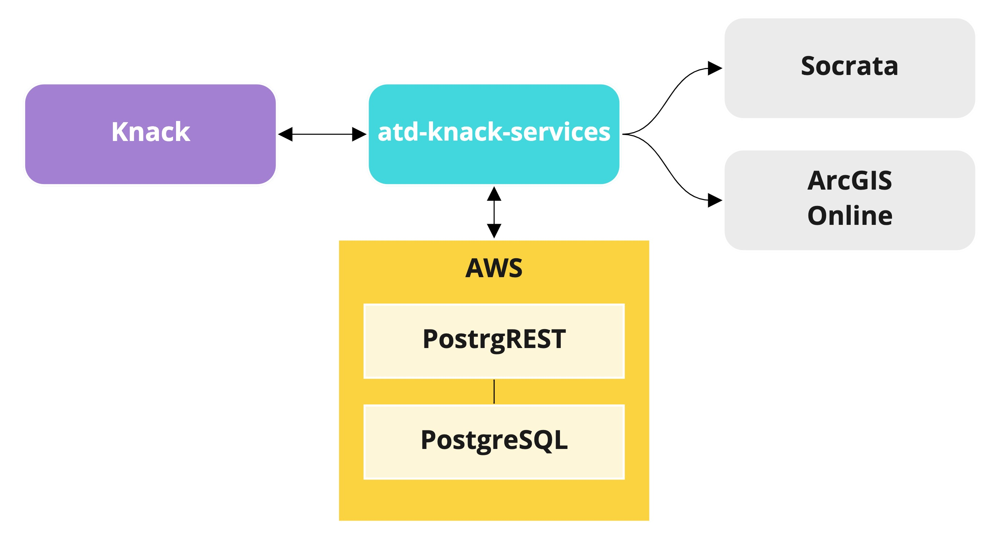

# atd-knack-services

ATD Knack Services is a set of pyhton modules which automate the flow of data from ATD's Knack applications to downstream systems.

These utilities are designed to:

- incrementally offload Knack application records and metadata as a JSON documents in a collection of S3 data stores
- incrementally fetch records and publish them to external systems such as Socrata and ArcGIS Online
- lay the groundwork for further integration with a data lake and/or a data warehouse
- be deployed in Airflow or similar task management frameworks



## TODO

- ability to replace entire contents of S3 bucket
- document docker CI
- warning: if you copy an app, the record IDs will change. do a replace!
- disable legacy publisher for those that have been migrated
- document field matching. think about field mapping...

## Core concepts

- Incremental loading and Knack filter limitations
- Truncating/replacing

## Configuration

### S3 data store

Data is stored in an S3 bucket (`atd-knack-services`), with one subdirectory per Knack application per environment. Each app subdirectory contains a subdirectory for each container, which holds invdividual records stored as JSON a file with its `id` serving as the filename. As such, each store follows the naming pattern `s3://atd-knack-services/<environment>/<app-name>/<container-id>`.

Application metadata is also stored as a JSON file at the root of each S3 bucket.

```
. s3://atd-knack-services
|-- prod
|   |-- data-tracker
|       |-- metadata.json
|       |-- view_1
|           |-- 5f31673f7a63820015ef4c85.json
|           |-- 5b34fbc85295dx37f1402543.json
|           |-- 5b34fbc85295de37y1402337.json
|           |...
```

Note that the S3 bucket name must be defined in `services/config/s3.py`.

```python
BUCKET_NAME = "atd-knack-services"
```

### App names

Throughout these modules we use predefined names to refer to Knack applications. We pull these names out of thin air, but they must be used conistently, because they are used in file paths in S3 and in our auth JSON.

Specifically, these app names need to be used consistently in `services/config/knack.py` and the `APP_NAME` environmental vaiable.

Whenever you see a variable or CLI argument named `app_name`, we're referring to these pre-defined app names.

### Auth & environmental variables

The required environmental variables for using these scripts are:

- `AWS_ACCESS_KEY_ID`: An AWS access key with read/write permissions on the S3 bucket
- `AWS_SECRET_ACCESS_KEY`: The AWS access key token
- `APP_ID`: The Knack App ID of the application you need to access
- `API_KEY`: The Knack API key of the application you need to access
- `SOCRATA_USERNAME`: A Socrata user name that has access to the destination Socrata dataset
- `SOCRATA_PASSWORD`: The Socrata account password
- `AGOL_USERNAME`: An ArcGIS Online user name that has access to the destination AGOL service
- `AGOL_PASSWORD`: The ArcGIS Online account password

You may elect to use an AWS credentials file, as described in the [`boto3` documentation](https://boto3.amazonaws.com/v1/documentation/api/latest/guide/credentials.html).

If you'd like to run locally in Docker, create an [environment file](https://docs.docker.com/compose/env-file/) and pass it to `docker run`. This command also overwrites the contents of the container's `/app` directory with your local copy of the repo:

```
$ docker run -it --rm --env-file env_file -v <absolute-path-to-this-repo>:/app atddocker/atd-knack-services:production services/records_to_socrata.py -a data-tracker -c object_11 -e prod
```

### Knack (`services/config/knack.py`)

Each Knack container which will be processed must have configuration parameters defined in `services/config/knack.py`, as follows:

```python
CONFIG = {
    <str: app_name>: {
        <str: continer_id>: <dict: container kwargs>
        },
    },
}
```

- `app_name` (`str`): The Knack application name. See note about application names, above.
- `container_id` (`str`): a Knack object or view key (e.g., `object_11`) which holds the records to be processed.

#### Container properties

- `scene_id` (`str`): If the container is a Knack view, this is required, and refers to the Knack scene ID which contains the view.
- `modified_date_field_id` (`str`, required): A knack field ID (e.g., `field_123`) which defines when each record was last modified. This field will be used to filter records for each ETL run.
- `description` (`str`, optional): a description of what kind of record this container holds.
- `socrata_resource_id` (`str`, optional): The Socrata resource ID of the destination dataset. This is required if publshing to Socrata.
- `location_fields` (`list`, optional): A list of knack field keys which will be translated to Socrata "location" field types or an ArcGIS Online point geometry.
- `service_id` (`str`, optional): The ArcGIS Online feature service identifier. Required to publish to ArcGIS Online.
- `layer_id` (`int`, optional): The ArcGIS Online layer ID of the the destination layer in the feature service.
- `upsert_matching_field` (`str`, optional): Required for publishing to arcgis online. The field name to be used to match records when upserting to ArcGIS Online. The field must be configured with a `unique` constraint on the layer.

## Services (`/services`)

### Load app metadata to S3

Use `metadata_to_s3.py` to load an application's metadata to S3.

```shell
$ python metadata_to_s3.py \
    --app-name data-tracker \
    --env prod \
```

#### CLI arguments

- `--app-name, -a` (`str`, required): the name of the source Knack application
- `--env, -e` (`str`, required): The application environment. Must be `prod` or `dev`.

### Load knack records to S3

Use `records_to_S3.py` to incrementally load data from a Knack container (an object or view) to an S3 bucket.

```shell
$ python records_to_S3.py \
    -a data-tracker \
    -c view_1 \
    -e prod \
    -d "2020-09-08T09:21:08-05:00"
```

#### CLI arguments

- `--app-name, -a` (`str`, required): the name of the source Knack application
- `--env, -e` (`str`, required): The application environment. Must be `prod` or `dev`.
- `--container, -c` (`str`, required): the name of the object or view key of the source container
- `--date, -d` (`str`, optional): an ISO-8601-compliant date string. If no timezone is provided, GMT is assumed. Only records which were modified at or after this date will be processed. If excluded, all records will be processed.

### Publish records to the open data portal

Use `records_to_socrata.py` to publish a Knack container to the Open Data Portal (aka, Socrata).

```shell
$ python records_to_socrata.py \
    -a data-tracker \
    -c view_1 \
    -e prod \
    -d "2020-09-08T09:21:08-05:00"
```

#### CLI arguments

- `--app-name, -a` (`str`, required): the name of the source Knack application
- `--container, -c` (`str`, required): the name of the object or view key of the source container
- `--env, -e` (`str`, required): The application environment. Must be `prod` or `dev`.
- `--date, -d` (`str`, optional): an ISO-8601-compliant date string. If no timezone is provided, GMT is assumed. Only records which were modified at or after this date will be processed. If excluded, all records will be processed.

### Publish records to ArcGIS Online

Use `records_to_agol.py` to publish a Knack container to an ArcGIS Online layer. Note that publishing to AGOL always inolves a complete truncate and replacee. Date filtering is not supported.

```shell
$ python records_to_agol.py \
    -a data-tracker \
    -c view_1 \
    -e prod \
```

#### CLI arguments

- `--app-name, -a` (`str`, required): the name of the source Knack application
- `--container, -c` (`str`, required): the name of the object or view key of the source container
- `--env, -e` (`str`, required): The application environment. Must be `prod` or `dev`.

## Utils (`/services/utils`)

The package contains utilities for fetching and pushing data between Knack applications and AWS S3.

### `utils.s3.upload`

Multi-threaded uploading of file-like objects to S3.

### `utils.s3.download_many`

Multi-threaded downloading of file objects from S3.

### `utils.s3.download_one`

Download a single file from S3.

## Deployment

An end-to-end ETL process will involve creating at least three Airflow tasks:

- Load app metadata to S3
- Load Knack records to S3
- Publish Knack records to destination system
